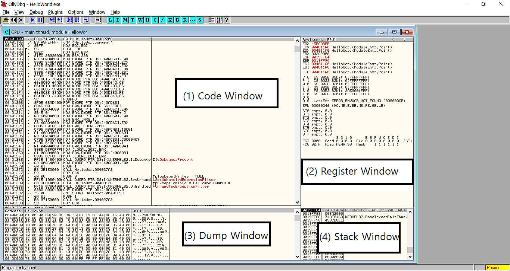
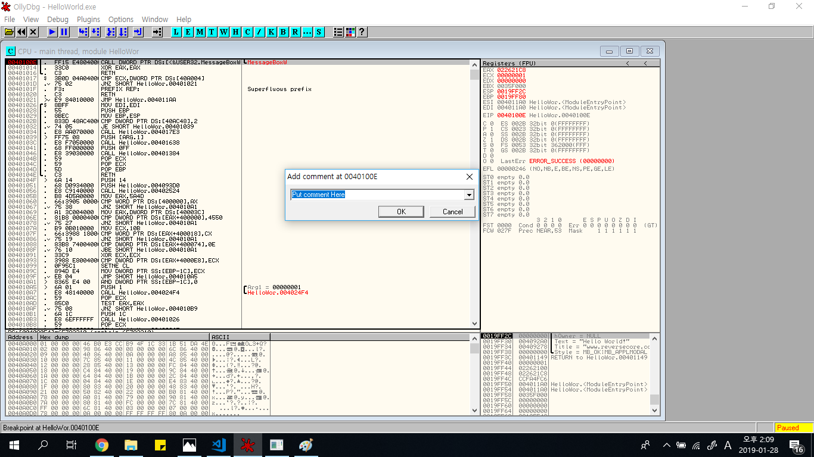
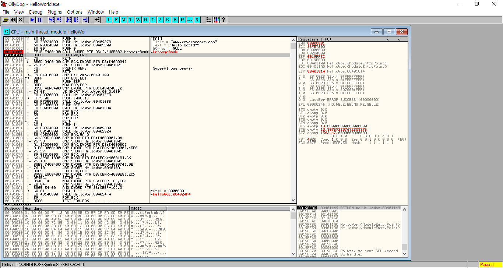
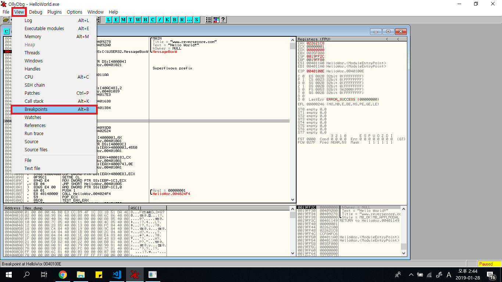
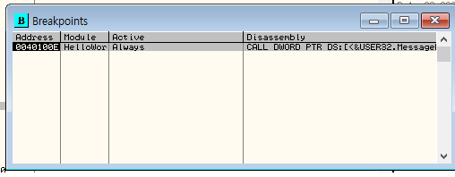
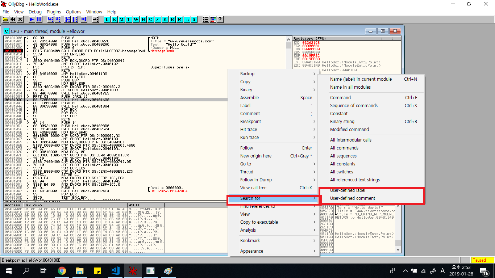
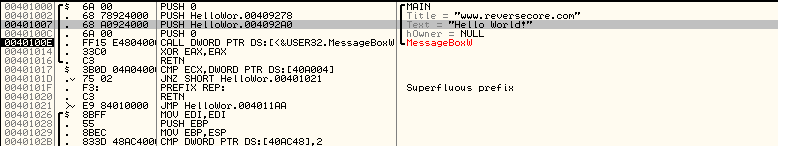
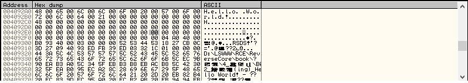
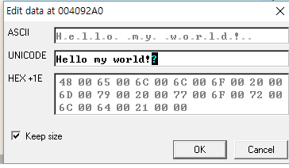
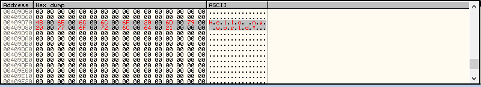

# 맨바닥에 헤딩하듯 시작한 리버싱 -이휘찬

## 1. 디버깅 도구 기초 사용법 알기
 이 자료는 향후 본인이 19학번 후배들을 교육하게 될 상황에 대비해서 끄적거리는 것임을 미리 알리는 바이다. 나중에 ppt만들어서 디코로 방송하면서 수업을 진행해볼까 한다.
 ### 1. main함수에 접근해 보자
 &nbsp;1강에서 예고했던 HelloWorld.exe를 디버깅 하기 위해서, 우리가 사용할 OllyDbg툴의 기본 사용법을 알아보자.
 우선 편의를 위해서, Ollydbg.exe의 바로가기를 바탕화면에 만들어 놓은 후에 "[그림1](screenshots/2gang-1.png )"과 같이 항상 관리자 권한으로 실행을 켜놓으면 좋다. 디버거의 기능을 전부 활용하기 위해서는 디버거를 관리자 권한으로 실행하는 것이 필수적이다.  
&nbsp;OllyDbg를 실행하고 "F3"키를 눌러 디버깅할 파일 HelloWorld.exe를 선택하고, "F9"키를 눌러서 EP(Entry Point, 프로그램이 시작하는 진입점)에 들어온 모습이 아래 그림과 같을 것이다.

이제부터 이것들이 각각 무엇인지 간략하게 나마 설명을 해보려고 한다.
#### 1.Code Window
기본적으로 기계어들을 어셈블리어로 풀어놓은 Disassemble code들을 보여주고, JMP명령어가 어디로 갈지, 유저가 등록해 놓은 comment나 label(나중에 설명할 것)을 보여주거나 하는 창이다.
#### 2. Register Window
전 강의에서 설명하였던 레지스터들을 보여주는 창이다. 일부 레지스터는 수정이 가능하다고 한다.
#### 3. Dump Window
프로세스에서 원하는 메모리 주소의 값들을 Hex(16진법)형식이나 ,ASCII/UNICODE형태로 보여주는 창이다.
#### 4. Stack Window
현재 프로그램에서 사용중인 스택 메모리 공간을 보여주는 창이다.

그리고 앞으로 이 프로그램을 사용하게 될 것인데, Code Window에서 동작하는 기본적인 명령어를 정리한 표를 알아두면 좋겠다. 
명령어 | 단축키 | 설명
--------- | --------- | ----------
Restart | [Ctrl+F2] | 처음부터 디버깅 다시 시작
Step Into | [F7] | 하나의 OP code 실행. CALL명령어 만나면 함수 안으로 들어감
Step Over | [F8] | 하나의 OP code 실행. CALL명령어 만나도 함수 안으로 X
Excute till return | [Ctrl+F9] | RET명령어 만날때까지 실행(함수 탈출 목적)

&nbsp;우리가 이 디버깅을 하는 목적은, 앞 강의에서 말한것 대로, MesssageBox에서 나오는 문자열을 바꿔치기 하기 위함이다. MessageBox함수의 위치는 main함수 안에 있음을 우리는 소스 코드를 봐서 알고 있는 상태이다. 우리는 수많은 어셈블리어 코드 중에서 우선 main함수를 맡고 있는 부분이 어디인지 알 필요가 있다. 그렇기 위해서 우선 위에서 설명한 명령어들을 이용해서 찾아보기로 하여 보자. 

&nbsp;우선 이 작업을 하기 전에 다들 알고 있을지는 모르겠지만, C++언어로 된 이 몇줄짜리 프로그램이 exe 실행파일이 되기 위해서는 컴파일러가 필요하다. 컴파일러는 우리가 고급 언어로 설계한 이 프로그램을 저급 언어인 기계어로 바꿔줄 뿐만 아니라, 프로그램 실행을 위한 여러 사전작업들을 해 주는데, 이것을 담당하는 코드를 Stub Code라고 부른다. 컴파일러 종류, 버전에 따라 이 Stub Code들이 달라진다고 하니, 다양한 환경에서 컴파일한 프로그램들을 디버깅 해본다면 이 Stub Code들에 익숙해 지는 것에 대해서 좋을 듯 하다.

 &nbsp;일단 EP에서 main함수를 찾기 위한 여정을 시작해 보자. 책에서는 리버싱 실력 향상을 위해서 Stub Code들을 [F7]이나 [F8]로 쭉 들여다 봐라고 하였으나, 이과정을 전부 사진을 담아 이 내용들을 정리하기엔 꽤 귀찮지만, 여러분들은 시간이 날 때 몇번 해보길 바란다. Main함수가 아닌것 같으면 [Ctrl+F9]로 탈출하면서, 그 과정을 거치다가 보면, Code Window에서 빨간색 글씨로 써져있는 글씨들이 있을 것인데, OllyDbg에서 자체적으로 제공하는 주석들이다. 읽어보면, 윈도 API등 이미 알려져있는 내용들이 많은것 같다. 우리가 호출한 API가 있는 함수가 Main일 터이니 계속 찾아보자.
어찌 되었건 이 프로그램의 Main함수 주소는 40100이다. 여기까지 어찌되었건 접근을 하게 되었다면 정말로 축하한다.

### 2.체크포인트 설치하기
&nbsp;여러분이 게임을 할 때, "체크포인트"라는 것을 경험해 봤을 것이다. 체크포인트는 게임 내에서 엔딩 이라는 목표를 보기 위해 많은 도움을 준다는 것을 알고 있을 것이다. 책을 읽을 때에도 책갈피가 있으면 중간에 책을 그만 읽더라도 나중에 시간을 내어 책을 읽을 때, 어디서 부터 읽을지 바로 알 수 있다. 리버싱에서도 이런 체크포인트들을 설치해서 키를 잘못눌러 디버깅을 다시 해야하는 상황이라도 빠르게 예전 진행 상황으로 돌아 갈 수 있는 기능들을 활용하면 매우 좋다. 체크포인트를 설치할 수 있는 기능들을 정리해 보았다.

#### 0.Goto 기능
요즘 게임을 할 때에는 특정한 지점에서 저장을 하고 싶으면 그곳까지 진행을 해서 저장해야 한다. 하지만 리버싱에서는 꼭 어떠한 지점 까지 진행을 해서 체크포인트를 설치할 필요는 없다. [Ctrl+G]를 Code Window에서 입력하여 나오는 팝업창에 원하는 주소를 입력하면 그쪽으로 커서를 바로 움직일 수 있다. 단 Goto로 이동했다고 하여, 그곳까지 실행은 되지 않음에 유의하라.

#### 1.BP(BreakPoint)
Visual Studio 같은 IDE를 통해서 학교 실습 시간에 문제를 풀어 나갈 것이다. 중단점부터 한단계씩 실행해 나가면서 코드 어디에 문제가 있는가를 찾아나가는 것은 디버깅할때 많은 도움이 된다. OllyDbg에도 중단점 기능을 제공한다. 중단점을 설치하기 원하는 코드를 클릭하고 [F2]를 누르면 선택한 코드의 주소 부분이 붉게 변함을 확인 할 수 있을 것이다.

<center>40100E 주소에 BP가 걸린 모습이다.</center>
이렇게 BP를 걸어놓고 재시작(Ctrl+F2)을 한다면 BP를 건 코드에서 실행을 일시중지 하게 될 것이다.  

#### 2.Comment(주석)
C언어 계열에서는 //를 이용해서, Python에서는 #를 이용해 코드의 뜻을 풀이하거나, 사용자가 할 말을 적어 문서화를 돕는 기능이 주석이다. OllyDbg에서 주석을 달려면 주석을 달고 싶은 코드에 [;](세미콜론)키를 눌러 주석을 달 수 있다.

위 그림처럼 코멘트를 입력하고 OK를 누르면 코드 오른쪽 공간에 자신이 쓴 주석이 나오는 것을 볼 수 있을 것이다. 

#### 3.Label
우리는 장소들을 주소로만 기억하지 않는다. 친구 철수네 집, 우리동네 슈퍼마켓 같은 특정한 이름을 붙혀 기억한다. 
```
JMP 401000
```
이렇게 생긴 코드보다
```
JMP MAIN
```
이렇게 코드가 짜여 있다면 코드가 무엇을 의미 하는지 알기 좋을 것이다. 첫째 코드를 둘째 코드의 형식으로 만들기 위해서는 401000 주소에 MAIN이라는 라벨을 붙이면 된다.
라벨을 붙이려면 붙이고 싶은 주소를 Code Window에서 클릭 하고 [Shift+;]즉 [:]를 입력하면 라벨 내용을 입력할 수 있다. 나오는 창은 코멘트 창과 유사하게 생겼으므로 이미지 첨부는 생략하겠다.

#### 4.OllyDbg 도움 받기
매번 [F7]과 [F8]을 눌러 가면서 원하는 부분을 찾는것은 정말로 피곤한 일이다. 우리가 찾아야 할 문자열이나 함수호출, 명령어 들을 Code Window에서 우클릭-> Search For 메뉴에서 원하는 것을 찾아서 그곳에 접근하거나 BP를 거는 등의 행동을 할 수 있다.
#### 5.체크포인트 활용하기
게임을 할 때 저장한 데이터를 불러올 수 없다면, 저장한 데이터는 무용지물이 될 것이다. 디버깅을 할 때에도 이렇게 체크포인트 들을 설정해 놨어도, 이것들을 활용할 수 없으면 무슨 소용이 있을까? 이것들을 불러오는 방법을 알아보도록 하자.
1. 내가 설치한 BP보기

<center>위 그림처럼 할 수도 있고 단축키[Alt+B]를 활용할 수 있다.


팝업창에 우리가 설치한 BP의 목록이 나오고 있다.</center>

2. 내가 설치한 Comment/Label 보기  
Code Window 에서 우클릭 하면 아래와 같은 화면이 나오고, 위 그림대로 진행하면 BP팝업처럼 한눈에 볼 수 있다.


## 2.Hello world.exe 패칭 하기
우리는 이제 Main함수에 접근 하였다. 우리의 처음 목적이었던 Hello World가 아닌 다른 문자열을 출력하도록 패칭하는 것을 드디어 할 수 있게 된 것이다. 아래의 그림에 주목해 주기 바란다.

&nbsp;원래 있었던 MessageBox함수의 인자들이 보이고, 밑에는 CALL 명령어로 MessageBox함수를 호출함을 알 수 있다. 필자가 예전에 시스템 해킹 수업을 들었을 떄, 이론부터 하고 실습에 들어가면 흥미가 떨어졌던 기억이 있어, 함수를 호출할 때 매개변수들이 어떻게 들어가는지에 대한 자세한 설명은 지금 다루지 않겠다. 우선 지금은 PUSH명령어를 통해 스택이라는 메모리 공간에 이 인자들을 넣어서 함수를 호출한다는 사실 정도만 알았으면 좋겠다.  

&nbsp;401007 주소에 PUSH 004092A0 라고 되어 있고, 그 옆에 Text = Hello World 라고 적혀 있음을 확인할 수 있다. PUSH 명령어는 PUSH 명령어 뒤에 있는 주소에 적힌 값을 스택이라는 메모리 공간에 집어 넣는다는 명령어이다. 004092A0에 있는 값을 변경하기 위해서 두가지 방법으로 패치를 해볼 것이다.  
### 1. 문자열이 적힌 주소로 직접 가서 Dump Window를 활용해 원래 있던 값을 변경하는 형태로 한번 작업을 하여 보자.  

&nbsp;Dump Window를 클릭 한 후 [Ctrl+G]를 입력 하여 004092A0주소에 접근을 한다면 아래 그림과 같은 모습을 볼 수 있을 것이다. 

Hello World가 보인다. 우리는 Hello World를 Hello my world로 바꿔보자. Hello world라고 되어 있는 부분보다 조금 더 길게(Hello world 보다 Hello my world가 조금 더 기니까)블록을 잡고, 우클릭 후 Binary->Edit 에 들어가보자.
  
위와 같은 팝업이 뜰 것이다. Unicode 오른쪽에 있는 텍스트 박스의 내용을 Hello my world!로 덮어쓴 모습이다. 덮어쓰고 Code Window에서 401007주소 옆의 주석을 다시 보면 우리가 적은 Hello my World로 변경된것을 확인 할 수 있다. 이것은 임시로 변경한 것이기 때문에, 이를 실행 가능한 파일로 저장 하기 위해서는 Dump Window에서 우리가 바꾼 부분을 블록 처리 한 후, 오른쪽 클릭하여 Copy to Executable 메뉴를 활용하여 실행파일을 만들고 그 파일을 실행시키면 바꾼 문자열이 나올 것이다.  
 
&nbsp;이 방법은 무척이나 간단하나 문제점이 있다. 만약에 우리가 패치할 문자열이 100글자가 넘는 긴 문자열이라고 한다면, 다른 데이터나 코드를 침범해서 프로그램의 안정성이 위험해 질 수 있다는 것이다. 이러한 현상은 좋지 않기 때문에 다음에 설명할 방법을 사용하는것을 조금 더 권장한다.

### 2. 파일의 빈 공간을 활용하여 새로운 공간에 문자열을 만들고 그것을 참조시키자  
함수에 인자가 전달되는 방식은 아까 보았듯이, PUSH명령어를 통해 특정한 "주소"에 있는 값들을 넘기는 것이다. 우리가 새로운 주소에 새로운 데이터를 넣어서 그 주소를 기존의 인자가 들어있던 주소와 바꿔친다면 같은 효과를 낼 수 있을 것이다.  

Dump Window 에서 아까 수정한 4092A0 주소에서 쭉 내리다 보면 00으로 가득한 영역(NULL PADDING 이라고 함)에 도착하게 된다. 이 영역은 프로그램 내에서 사용하지 않는 영역이므로 이 부분에 우리가 원하는 데이터를 넣고 그 데이터가 시작하는 주소를 함수에 넘겨주면 된다.
  
적당한 영역에 우리가 원하는 문자열을 넣었다. 넣는 방법은 아까 했듯이 영역선택->우클릭->binary->edit하여 Unicode로 이 문자열을 넣으면 된다. 이 경우에는 이 문자열이 시작하는 주소가 409D70이다. 이 주소를 어디 적어놓는것이 좋을 것이다.  
Main 함수에 있는 기존 Hello world 문자열을 넣던 401007 주소에 있는 코드를 더블클릭 하면 기존의 코드를 수정 할 수 있다. PUSH <기존의 주소>로 되어 있는것을
```
PUSH 401007
```
이렇게 수정을 한 후 파일에 저장을 하려고 하면, 저장이 안된다거나, 실행이 안된다거나 하는 문제가 생기는데, 이를 정확히 하려면 나중에 윈도우에서 주로 쓰이는 PE FILE에 대한 이해가 필요하기에 이번 강의에서는 이정도만 다루도록 하겠다.